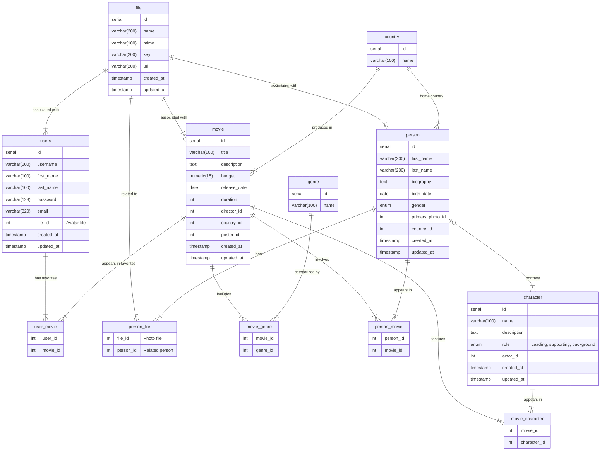

## ER diagram

```mermaid
erDiagram
    users ||--|{ user_movie : "has favorites"
    users {
        serial id
        varchar(100) username
        varchar(100) first_name
        varchar(100) last_name
        varchar(128) password
        varchar(320) email
        int file_id "Avatar file"
        timestamp created_at
        timestamp updated_at
    }

    file ||--|{ users : "associated with"
    file ||--|{ movie : "associated with"
    file ||--|{ person : "associated with"
    file ||--|{ person_file : "related to"
    file {
        serial id
        varchar(200) name
        varchar(100) mime
        varchar(200) key
        varchar(200) url
        timestamp created_at
        timestamp updated_at
    }

    movie ||--|{ user_movie : "appears in favorites"
    movie ||--|{ movie_genre : "includes"
    movie ||--|{ movie_character : "features"
    movie ||--|{ person_movie : "involves"
    movie {
        serial id
        varchar(100) title
        text description
        numeric(15) budget
        date release_date
        int duration
        int director_id
        int country_id
        int poster_id
        timestamp created_at
        timestamp updated_at
    }

    genre ||--|{ movie_genre : "categorized by"
    genre {
        serial id
        varchar(100) name
    }

    country ||--|{ movie : "produced in"
    country ||--|{ person : "home country"
    country {
        serial id
        varchar(100) name
    }

    character ||--|{ movie_character : "appears in"
    character {
        serial id
        varchar(100) name
        text description
        enum role "Leading, supporting, background"
        int actor_id
        timestamp created_at
        timestamp updated_at
    }

    person |o--|{ character : "portrays"
    person ||--|{ person_file : "has"
    person ||--|{ person_movie : "appears in"
    person {
        serial id
        varchar(200) first_name
        varchar(200) last_name
        text biography
        date birth_date
        enum gender
        int primary_photo_id
        int country_id
        timestamp created_at
        timestamp updated_at
    }

    person_file {
        int file_id "Photo file"
        int person_id "Related person"
    }

    user_movie {
        int user_id
        int movie_id
    }

    movie_genre {
        int movie_id
        int genre_id
    }

    movie_character {
        int movie_id
        int character_id
    }

    person_movie {
        int person_id
        int movie_id
    }
```
