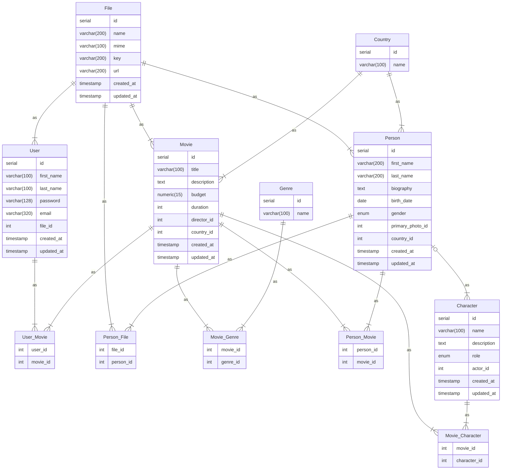

## ER diagram

```mermaid
erDiagram
    User ||--|{ User_Movie : as
    User {
        serial id
        varchar(100) first_name
        varchar(100) last_name
        varchar(128) password
        varchar(320) email
        int file_id
        timestamp created_at
        timestamp updated_at

    }
    File ||--|{ User : as
    File ||--|{ Movie : as
    File ||--|{ Person : as
    File ||--|{ Person_File : as
    File {
        serial id
        varchar(200) name
        varchar(100) mime
        varchar(200) key
        varchar(200) url
        timestamp created_at
        timestamp updated_at
    }

    Movie ||--|{ User_Movie : as
    Movie ||--|{ Movie_Genre : as
    Movie ||--|{ Movie_Character : as
    Movie ||--|{ Person_Movie : as
    Movie {
        serial id
        varchar(100) title
        text description
        numeric(15) budget
        int duration
        int director_id
        int country_id
        timestamp created_at
        timestamp updated_at
    }

    Genre ||--|{ Movie_Genre : as
    Genre {
        serial id
        varchar(100) name
    }


    Country ||--|{ Movie : as
    Country ||--|{ Person : as
    Country {
        serial id
        varchar(100) name
    }

    Character ||--|{ Movie_Character : as
    Character {
        serial id
        varchar(100) name
        text description
        enum role
        int actor_id
        timestamp created_at
        timestamp updated_at
    }

    Person |o--|{ Character : as
    Person ||--|{ Person_File : as
    Person ||--|{ Person_Movie : as
    Person {
        serial id
        varchar(200) first_name
        varchar(200) last_name
        text biography
        date birth_date
        enum gender
        int primary_photo_id
        int country_id
        timestamp created_at
        timestamp updated_at
    }

    Person_File {
        int file_id
        int person_id
    }

    User_Movie {
        int user_id
        int movie_id
    }

    Movie_Genre {
        int movie_id
        int genre_id
    }

    Movie_Character {
        int movie_id
        int character_id
    }

    Person_Movie {
        int person_id
        int movie_id
    }
```
